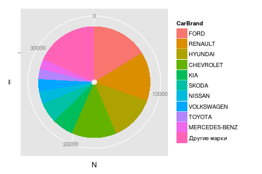
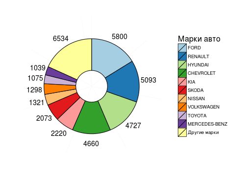
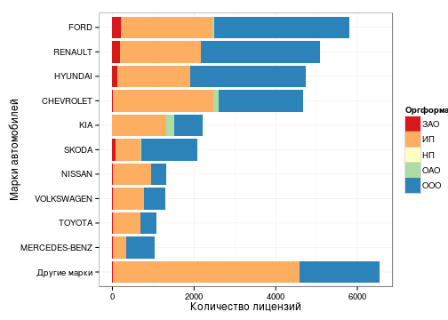
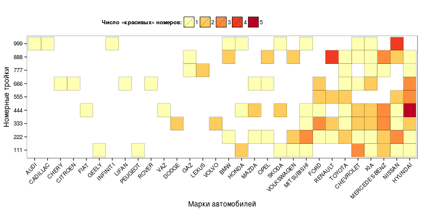

# Анализ и визуализация реальных табличных данных в R
Материал будет полезен тем, кто осваивает язык R в качестве инструмента анализа табличных данных и хочет увидеть сквозной пример реализации основных шагов обработки.
Ниже демонстрируется загрузка данных из csv-файлов, разбор текстовых строк с элементами очистки данных, агрегация данных по аналитическим измерениям и построение диаграмм.

В примере активно используется функциональность пакетов data.table, reshape2, stringdist и ggplot2.

## Исходные данные
В качестве "реальных данных" взята информация о выданных разрешениях на осуществление деятельности по перевозке пассажиров и багажа легковым такси в Москве. Данные предоставлены в общее пользование Департаментом транспорта и развития дорожно-транспортной инфраструктуры города Москвы. Страница набора данных http://data.mos.ru/datasets/655

Исходные данные имеют следующий формат:
```
ROWNUM;VEHICLE_NUM;FULL_NAME;BLANK_NUM;VEHICLE_BRAND_MODEL;INN;OGRN
1;"А248УЕ197";"ООО «ТАКСИ-АВТОЛАЙН»";"017263";"FORD FOCUS";"7734653292";"1117746207578"
2;"А249УЕ197";"ООО «ТАКСИ-АВТОЛАЙН»";"017264";"FORD FOCUS";"7734653292";"1117746207578"
3;"А245УЕ197";"ООО «ТАКСИ-АВТОЛАЙН»";"017265";"FORD FOCUS";"7734653292";"1117746207578"
...
```
### 1. Загрузка первичных данных
Данные можно загружать непосредсвенно с сайта. В процессе загрузки сразу переименуем колонки удобным образом.

```r
url <- "http://data.mos.ru/datasets/download/655"
colnames = c("RowNumber", "RegPlate", "LegalName", "DocNum", "Car", "INN", "OGRN", "Void")
rawdata <- read.table(url, header = TRUE, sep = ";",
             colClasses = c("numeric", rep("character",6), NA),
             col.names = colnames,
             strip.white = TRUE,
             blank.lines.skip = TRUE,
             stringsAsFactors = FALSE,
             encoding = "UTF-8")
```

Загружено строк: 35840.

### 2. Преобразование данных
Предположим, что необходимо проанализировать распределение количества зарегистрированных в качестве такси автомобилей, в зависимости от организационной формы лицензиата и от марки автомобиля. Соответствующие данные не выделены отдельно, но вся нужная информация содержится в полях FULL_NAME (переименовано в LegalName) и VEHICLE_BRAND_MODEL (Car).
В процессе пребразования исходных данных необходимо
 - из поля LegalName выделить организационно-правовую форму в отдельное поле OrgType;
 - из поля Car выделить марку машины в отдельное поле CarBrand;
 - отбросить неиспользуемые поля.

Для простоты считаем, что первые слова полей **LegalName** и **Car** составляют, соответственно, организационно-правовую форму и марку машины (ниже будет понятно, что делать с исключениями). Ненужные поля будут отброшены автоматически в процессе преобразования *data.frame* в *data.table* с явным указанием списка переносимых полей.

```r
ptn <- "^(.+?) (.+)$" # regexp pattern to match first word
dt <- data.table(rawdata)[, 
            list(RegPlate, LegalName, Car, OGRN,
                 OrgType  = gsub(ptn, "\\1" , toupper( LegalName )),
                 CarBrand = gsub(ptn, "\\1",  toupper( Car      )))                          
            ]
rm(rawdata) # Clear some memory
```

### 3. Первые итоги
Проверим, какие организационные формы были выделены из данных.

```r
sort( table(dt$OrgType) )
```

```
## 
##    НП   ОАО   ЗАО   ООО    ИП 
##     1   392   649 17118 17680
```

Данные сформированы вполне корректно: по количеству полученных лицензий лидируют индивидуальные предприниматели (снижение налоговой нагрузки?), есть общества с ограниченной ответственностью, открытые и закрытые акционерные общества и даже одно некоммерческое партнерство.

Для того, чтобы определить, сколько независимых **лицензиатов** (а не автомобилей) получили лицензию, в зависимости от организационно-правовой формы, необходимо провести суммирование по полю, уникально характеризующему юридическое лицо (ОГРН).

```r
dt[, list( N = length( unique(OGRN) ) ), by = OrgType][order(N, decreasing = TRUE)]
```

```
##    OrgType     N
## 1:      ИП 12352
## 2:     ООО   563
## 3:     ЗАО    14
## 4:     ОАО     6
## 5:      НП     1
```

## Очистка данных
Автомобили каких марок используются в качестве такси в Москве? 

В наборе данных представлено немало марок автомобилей: 115, но действительно ли они все уникальные? Для примера выведем все марки, начинающиеся на букву "M".

```r
sort( unique( dt[grep("^M.*", CarBrand), CarBrand]))
```

```
##  [1] "M214"                 "MASERATI"             "MAZDA"               
##  [4] "MAZDA-"               "MERCEDES"             "MERCEDES-BENZ"       
##  [7] "MERCEDES-BENZ-"       "MERCEDES-BENZ-S500"   "MERCEDES-BENZC"      
## [10] "MERCEDES-BENZE200K"   "MERCEDES-BENZE220CDI" "MERCEDES-BЕNZ"       
## [13] "MERCERDES-BENZ"       "MERCRDES"             "MERCRDES-BENZ"       
## [16] "MERSEDES-"            "MERSEDES-BENZ"        "METROCAB"            
## [19] "MG"                   "MINI"                 "MITSUBISHI"
```

К сожалению, большое число марок машин во многом обусловлено ошибками в данных. К примеру, одна и та же марка - MERCEDES-BENZ - встречается под различными именами. Перед анализом данные необходимо очистить.

Программная основа для очистки текстовой информации - функции поиска "расстояния между строками". Для каждой пары строк они вычисляют метрику, характеризующую трудоемкость преобразования одной строки в другую с помощью операций над буквами. Чем более похожи строки, тем меньше требуется операций. В идеале одинаковые строки должны иметь расстояние, равное нулю, а максимально непохожие - единице. Именно так и работает алгоритм Jaro-Winkler функции stringdist одноименного пакета. 

Сравним несколько строк, только посчитаем не расстояние, а похожесть, 1-stringdist.

```r
1 - stringdist( c("MERCEDES","MERSEDES","MAZDA","RENAULT","SAAB"), "MERCEDES", method = "jw", p = 0.1)
```

```
## [1] 1.0000 0.9417 0.5950 0.3452 0.0000
```

На первый взгляд задача очистки данных решается просто: для каждой записи достаточно выбрать наиболее похожее значение из справочника. К сожалению, такой подход не всегда работает. Во-первых, справочника может не быть (как в текущем случае). Во-вторых, некоторые ситуации требуют ручной коррекции данных, даже при наличии точного справочника. Например, с точки зрения метода три марки одинаково подходят в качестве альтернативы неверному значению "BAZ":

```r
1 - stringdist("BAZ", c("VAZ", "UAZ", "ZAZ"), method = "jw", p = 0.1)
```

```
## [1] 0.7778 0.7778 0.7778
```

Ниже использован полуавтоматический метод коррекции, позволяющий существенно облегчить труд специалиста по очистке данных за счет программной генерации вариантов исправлений, с которыми аналитик может либо согласиться, либо вручную поправить. 

Предполагается, что в большом объеме данных с малым количеством ошибок часто встречающиеся значения - корректные, а редко встречающиеся - ошибки. Частоты значений используются в качестве весового коэффициента, пропорционально увеличивая метрику близости строк. Чтобы часто встречающиеся марки машин не выходили вперед за счет количества, а не похожести, учитываются только метрики значений со степенью похожести выше порогового значения t (о выборе t позже). Для каждого возможного значения марки машины, таким образом, определяется рекомендованное "справочное" значение из того же набора данных. Пары "марка - предложенное исправление" выводятся в csv-файл. После анализа и внесения исправлений скорректировнный csv-файл загружается и служит словарем.

Начнем с конструирования функции, возвращающей наилучшее соответствие на имеющемся наборе данных.

```r
bestmatch.gen <- function(wc, t = 0){
  # wc = counts of all base text words
  # t = threshold: only the words with similarity above threshold count
          
  bestmatch <- function(a){
    sim <- 1 - stringdist( toupper(a), toupper( names(wc) ) , method = "jw", p = 0.1 )
    # Compute weights and implicitly cut off everything below threshold
    weights <- sim * wc * (sim > t)
    # Return the one with maximum combined weight
    names( sort(weights, decr = TRUE)[1] )
  }
  bestmatch
}
```

Пороговое значение t подбирается опытным путем. Вот пример работы функции для порогового параметра t = 0.7.

```r
  bm07 <- bestmatch.gen( table( dt$CarBrand), t = 0.7 )
  s <- c("FORD","RENO","MERS","PEGO")
  sapply(s, bm07)
```

```
##            FORD            RENO            MERS            PEGO 
##          "FORD"       "RENAULT" "MERCEDES-BENZ"       "PEUGEOT"
```

На первый взгляд, все сработало чудесно. Однако радоваться рано. Хорошо представленные в наборе данных марки машин с похожими названиями могут "перетягивать на себя" другие корректные названия.

```r
s <- c("HONDA", "CHRYSLER", "VOLVO")
sapply(s, bm07)
```

```
##        HONDA     CHRYSLER        VOLVO 
##    "HYUNDAI"  "CHEVROLET" "VOLKSWAGEN"
```

Попробуем повысить пороговое значение t.

```r
  bm09 <- bestmatch.gen( table( dt$CarBrand), t = 0.9 )
  s <- c("HONDA","CHRYSLER","VOLVO")
  sapply(s, bm09)
```

```
##      HONDA   CHRYSLER      VOLVO 
##    "HONDA" "CHRYSLER"    "VOLVO"
```

Все в порядке? Почти. Слишком жесткое отсечение непохожих строк приводит к тому, что алгоритм считает некоторые ошибочные значения корректными. Подобные ошибки придется исправить вручную.

```r
s <- c("CEAT", "CVEVROLET")
sapply(s, bm09)
```

```
##        CEAT   CVEVROLET 
##      "CEAT" "CVEVROLET"
```

----
Теперь все готово для формирования файла словаря уникальных значений марок машин. Так как файл нужно будет править руками, удобно, если в нем будут дополнительные поля, показывающие, отличается ли предложенная замена от исходного значения (это не всегда очевидно), насколько часто встречается название марки, а также метка, привлекающая внимание к записи в зависимости от каких-то статистических характеристик набора. В данном случае мы хотим выловить ситуации, в которых алгоритм предлагает редко встречающиеся (предположительно ошибочные) значения в качестве корректных.

```r
ncb <- table(dt$CarBrand)
scb <- names(ncb) # Source Car Brands
acb <- sapply(scb, bm09) # Auto-generated replacement
cbdict_out <- data.table(ncb)[,list(
                SourceName = scb,
                AutoName = acb,
                SourceFreq = as.numeric(ncb),
                AutoFreq = as.numeric( ncb[acb] ),
                Action = ordered( scb == acb, labels = c("CHANGE","KEEP")),
                DictName = acb
              )]
# Add alert flag
# Alert when suggested is a low-frequency dictionary word
cbdict_out <- cbdict_out[,
                Alert := ordered( AutoFreq <= quantile(AutoFreq, probs = 0.05, na.rm = TRUE),                   
                labels = c("GOOD","ALERT"))
                ]
write.table( cbdict_out[ order(SourceName), 
                         list( Alert, Action, SourceName, AutoName, SourceFreq, AutoFreq, DictName) 
                       ], 
            "cbdict_out.txt", sep = ";", quote = TRUE, 
            col.names = TRUE, row.name = FALSE, fileEncoding = "UTF-8")                      
```

Необходимо проверить и отредактировать значения поля DictName и сохранить файл под именем "cbdict_in.txt" для последующей загрузки.
Анализируемый набор данных имеет особенности, на которые стоит обратить внимание:
- некоторые строки не содержат марки машины - пусто или "НЕТ", а некоторые модели сложно однознвчно идентицифировать: L1H1, M214; вручную меняем на UNKNOWN или аналогичное псевдо-значение;
- равноправно применяется два варианта написания: MERCEDES и MERCEDES-BENZ, оставляем одно, MERCEDES-BENZ;
- есть два визуально одинаковых независимых написания ZAZ (в выводе две строки, и обе ллгоритм предлагает сохранить как верные, Action = KEEP); видимо, где-то вкралась буква с другим кодом UTF-8;
- некоторые названия машин не содержат марки, а тольмко модель: SAMAND (IRAN KHODRO)
- неразбериха с марками TAGAZ - VORTEX и JAC; предлагается для простоты присвоить (пусть не совсем корректно) общее название TAGAZ машинам, чьи марки определились как TAGAZ, A21, SUV, SUVT11, VORTEX, JAC.

Помимо особенностей данных есть ограничения алгоритма, которые нужно корректировать вручную.
- алгоритм предлагает некоторые ошибочные названия в качестве корректных альтернатив: CEAT, CVEVROLET;
- марки состоящие из двух слов, сокрашаются до одного: ALFA (ALFA ROMEO), GREAT (GREAT WALL), IRAN (IRAN KHODRO), LAND (LAND ROVER).

Отредактированные данные загружаем из файла cbdict_in.txt

```r
if ( file.exists("cbdict_in.txt")) url <- "cbdict_in.txt" else url <- "cbdict_out.txt"

cbdict_in <- read.table( url, header = TRUE, sep = ";",
                         colClasses = c( rep("character",4), "numeric", "numeric", "character"),
                         encoding = "UTF-8")

cbdict <- cbdict_in$DictName
names(cbdict) <- cbdict_in$SourceName                   
```

И исправляем значения марок машин в таблице данных.

```r
dt[, CarBrand := cbdict[CarBrand]]
dt[is.na(CarBrand), CarBrand := "UNKNOWN"]
```

После очистки уникальных значений марок машин стало меньше практически в два раза

```r
length( unique(dt$CarBrand) )
```

```
## [1] 72
```


## Ответы на аналитические вопросы
### 1. Top 10 организаций
Определим 10 наиболее крупных таксопарков. В данном случае необходимо построить рейтинг по одному измерению - ОГРН.

```r
st <- dt[, list( NumCars = length(RegPlate)), by = list(OGRN, LegalName) ]
head( st[order( NumCars, decreasing = TRUE)], 10)
```

```
##              OGRN             LegalName NumCars
##  1: 1137746197104            ООО «СОЛТ»     866
##  2: 1037727000893    ООО «СТИЛЬ-МОТОРС»     751
##  3: 1067746273198      ООО «РИТМ ЖИЗНИ»     547
##  4: 1037789018849           ООО «ТАКСИ»     541
##  5: 1127746010700      ООО «ТАКСИ-24 М»     406
##  6: 1057748223653 ООО «ЕВРОТРАНССЕРВИС»     349
##  7: 5067746596297        ООО «АВТОРЕЙС»     288
##  8: 1027739272175          ОАО «14 ТМП»     267
##  9: 1137746133250     ООО «СИТИ СЕРВИС»     255
## 10: 5077746757688             ООО «ЦПК»     238
```

К сожалению, в рассматриваемом наборе данных хранится только юридическая информация о лицензиатах, а не торговая марка. В Интернете возможно по названию организации и ОГРН найти, под каким брендом работает таксопарк, но этот процесс не автоматический. Результаты поиска наиболее крупных таксопарков собраны в файле "top10orgs.csv".

```r
top10orgs <- data.table( read.table( "top10orgs.csv", 
  header = TRUE, sep = ";", colClasses = "character", encoding = "UTF-8"))
```

Воспользуемся встроенными возможностями data.table по проведению операции JOIN двух таблиц.

```r
setkey(top10orgs,OGRN)
setkey(st,OGRN)
st[top10orgs][order(NumCars, decreasing = TRUE), list(OrgBrand, EasyPhone, NumCars)]
```

```
##               OrgBrand EasyPhone NumCars
##  1:               СОЛТ 781 81 82     866
##  2:           Такси956 956 8 956     751
##  3:         Такси-Ритм 641 11 11     547
##  4:    Городское Такси 500 0 500     541
##  5:            Такси24 777 66 24     406
##  6:      Формула такси 777 5 777     349
##  7: Новое желтое такси 940 88 88     288
##  8:       14 Таксопарк 707 2 707     267
##  9:              Cabby 21 21 989     255
## 10:     Глававтопрокат 927 11 11     238
```

### 2. Три наиболее популярные автомарки, в зависимости от формы юридического лица
Какие марки машин наиболее популярны, в завимимости от юридической формы лицензиата? Для ответа на этот вопрос нужно провести агрегацию данных по двум измерениям - марка машины и орформа.

Процесс идет в три этапа:
- 1. Вычисление агрегированного показателя (в данном случае число машин по ОГРН).
- 2. Вычисление ранга.
- 3. Ограничение ранга (top 3), сортировка, перераспределение колонок и вывод данных.

```r
st <- dt[, list(AGGR = length(RegPlate)), by = list(OrgType, CarBrand) ]
st.r <- st[, list(CarBrand, AGGR, 
                  r = ( 1 + length(AGGR) - rank(AGGR, ties.method="first"))), 
           by = list(OrgType)] # ranking by one dimension
st.out <- st.r[ r <= 3 ][, list(r, OrgType, cval = paste0(CarBrand," (",AGGR,")"))]
dcast(st.out, r ~ OrgType, value.var = "cval")[-1] # reshape data and hide r
```

```
##             ЗАО               ИП        НП             ОАО            ООО
## 1    FORD (212) CHEVROLET (2465) VOLVO (1)       KIA (192)    FORD (3297)
## 2 RENAULT (175)      FORD (2238)      <NA> CHEVROLET (115) RENAULT (2922)
## 3 HYUNDAI (122)   RENAULT (1996)      <NA>       FORD (53) HYUNDAI (2812)
```

## Визуализация
### 1. Отображение данных в виде круговой диаграммы
Круговая (секторная) диаграмма, Pie Chart, весьма популярна в бизнес-среде, но подвергается обоснованной критике профессионалами анализа данных. Тем не менее, ее нужно уметь "готовить".
Пусть требуется отобразить распределение числа лицензий такси, по автомаркам. Чтобы не перегружать диаграмму покажем только марки с количеством лицензий не меньше 1000.

```r
st <- dt[, list(N = length(RegPlate)), by = CarBrand ] # Summary table
st <- st[, CarBrand := reorder(CarBrand, N) ]
piedata <- rbind(
  st[ N >= 1000 ][ order(N, decreasing=T) ],
  data.table( CarBrand = "Другие марки", N = sum( st[N < 1000]$N) )
  )
piedata
```

```
##          CarBrand    N
##  1:          FORD 5800
##  2:       RENAULT 5093
##  3:       HYUNDAI 4727
##  4:     CHEVROLET 4660
##  5:           KIA 2220
##  6:         SKODA 2073
##  7:        NISSAN 1321
##  8:    VOLKSWAGEN 1298
##  9:        TOYOTA 1075
## 10: MERCEDES-BENZ 1039
## 11:  Другие марки 6534
```

Для построения графика хотелось бы зафиксировать именно такой порядок следования марок. Если этого не сделать, то автоматическая сортировка выведет "Другие марки" с последнего места на первое.

```r
piedata <- piedata[, CarBrand := factor(CarBrand, levels = CarBrand, ordered = TRUE)]
```

Для построения диаграммы используем ggplot2.

```r
pie <-  ggplot(piedata, aes( x = "", y = N, fill = CarBrand)) + 
        geom_bar(stat = "identity") +
        coord_polar(theta = "y")
pie
```



Вывод уже достаточно информативен. Однако хотелось бы внести ряд визуальных улучшений:
- убрать серый фон, границы, круговую ось, подписи и отметки;
- выбрать более различимую цветовую шкалу и обвести каждый "кусок пирога";
- рядом с каждым сектором проставить число лицензий, соотвествующее марке;
- дать текстовое название легенде.

Код ниже позволяет сделать все перечисленное. Для отображения надписей рядом с секторами пришлось добавить поле с расчетом точки центра сектора (подсмотрено у [artelstatistikov.ru](http://artelstatistikov.ru/r/krugovaya-diagramma-v-r-c-pomoshh-yu-ggplot-krasny-e-zelyony-e-zolotopogonny-e.html))

```r
piedata <- piedata[, pos := cumsum(N) - 0.5*N ]
pie <-  ggplot(piedata, aes( x = "", y = N, fill = CarBrand)) +
        geom_bar( color = "black", stat = "identity", width = 0.5) +
        geom_text( aes(label = N, y = pos), x = 1.4, color = "black", size = 5) +
        scale_fill_brewer(palette = "Paired", name = "Марки авто") +
        coord_polar(theta = "y") +
        theme_bw() +
        theme ( panel.border = element_blank()
              , panel.grid.major = element_blank()
              , axis.ticks = element_blank()
              , axis.title.x = element_blank()
              , axis.title.y = element_blank()
              , axis.text.x = element_blank()
              , legend.title = element_text(face="plain", size=16)
              )
pie
```



### 2. Столбчатая диаграмма
Более информативная альтернатива кругу - столбчатая диаграмма, Bar Chart. Помимо того, что длины столбиков удобнее сравнивать, чем длины дуг или площади секторов круга, столбчатая диаграмма может дополнительно отобразить, например, распределении числа лицензий по оргформам.

```r
st <- dt[, list(N = length(RegPlate)), by = list(OrgType, CarBrand) ] # Summary table
cbsort <- st[, list( S = sum(N) ), keyby = CarBrand ] # Order by total number
setkey(st, CarBrand)
st <- st[cbsort] # Join

topcb <- st[ S >= 1000 ][ order(S) ]
bottomcb <- st[S < 1000, list(CarBrand = "Другие марки", OrgType, N = sum(N)), by = OrgType]
bottomcb <- bottomcb[, list(CarBrand, OrgType, N, S = sum(N))]

bardata <- rbind( bottomcb, topcb)  
bardata <- bardata[, CarBrand := factor(CarBrand, levels = unique(CarBrand), ordered=T)]
#
bar <-  ggplot(bardata, aes(x = CarBrand, weight = N, fill = OrgType)) +
        geom_bar() + coord_flip() +
        scale_fill_brewer(palette = "Spectral", name = "Оргформа") +
        labs(list(y = "Количество лицензий", x = "Марки автомобилей")) +
        theme_bw()
bar
```



### 3. Диаграмма Heat Map (Теплокарта)
Предположим, требуется получить ответ на вопрос: "Хозяева каких марок машин (среди таксистов) больше всего подвержены моде на «красивые» номера?". Красивыми в данном случае будем считать номера с одинаковыми цифрами в тройках: 111, 222 и т.д.
Анализ ведется по двум аналитическим измерениям - марка машины и тройка. Показатель - количество машин с заданным сочетанием марки и тройки. Для визуализации такого набора данных хорошо подходит визуальный аналог таблицы - диаграмма heat map. Чем более популярна тройка, тем более интенсивный цвет кодирует значение ячейки.

```r
ln <- dt[grep( "^[^0-9]([0-9])\\1{2}.+$" , RegPlate),
         list(CarBrand, LuckyNum = gsub("^[^0-9]([0-9]{3}).+$","\\1", RegPlate))]
ln <- ln[, list( N = .N),  by = list(CarBrand, LuckyNum) ]
ln <- ln[, Luck := sum(N), by = list(CarBrand) ] # Total number of lucky regplates per car brand
ln <- ln[, CarBrand := reorder(CarBrand, Luck) ]
#
heatmap <-  ggplot(ln, aes(x = CarBrand, y = LuckyNum)) +  
            geom_tile( aes(fill = as.character(N)), color = "black") + 
            scale_fill_brewer(palette = "YlOrRd", name = "Число «красивых» номеров:") +
            labs(list(x = "Марки автомобилей", y = "Номерные тройки")) +
            theme_bw() +
            theme ( panel.grid.major=element_blank()
                    , axis.text.x = element_text(angle = 45, hjust = 1)
                    , axis.title.y = element_text(vjust = 0.3)
                    , legend.position = "top"
                    , legend.title.align = 1
            )
heatmap
```



Во всех диаграммах использованы научно обоснованные цветовые палитры проекта [Color Brewer 2.0](http://colorbrewer2.org).
